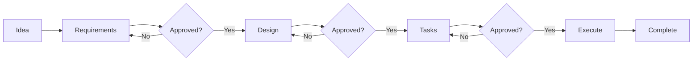
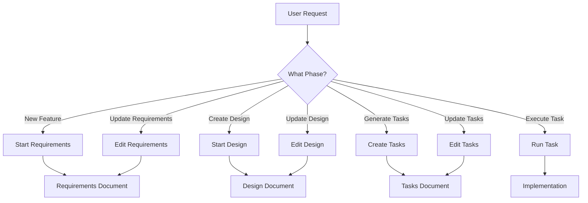
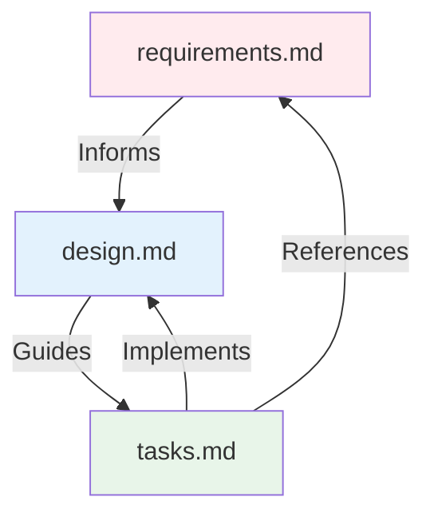
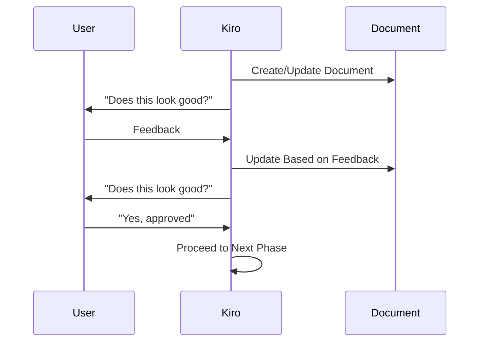
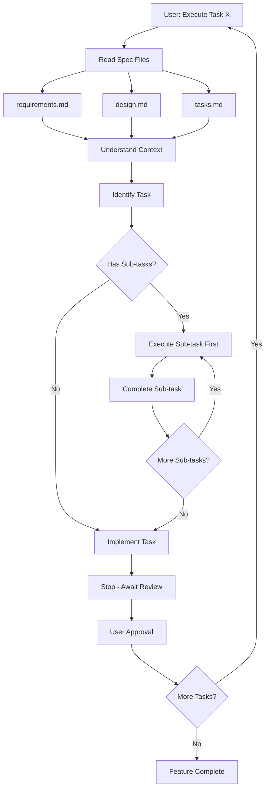

## 📌 Project Status (Feb 7, 2026)

Bl1nk Agents Manager is in active development and is not feature‑complete yet.
This repo contains a working extension shell and a Rust core that is being
brought to feature parity with existing TypeScript logic.

**What works now**
- Extension manifest and Gemini CLI scaffolding are present.
- Core Rust modules exist for agents, hooks, MCP/ACP, sessions, and RPC.
- Command and documentation sets are present (currently being refreshed).

**In progress**
- TypeScript → Rust parity for large subsystems (background agents, config,
  ACP normalization).
- End‑to‑end session flows for Gemini/Codex/Qwen within a unified adapter.
- Validation of hook behavior and task orchestration across agents.

**Known gaps**
- Some Rust modules compile but are not fully wired end‑to‑end.
- Configuration loading/migration is still being aligned to actual runtime.
- Authentication flows for some CLIs still require manual steps.

**What to expect right now**
- You can explore the architecture, commands, and agent catalogs.
- Some workflows will still require manual setup or troubleshooting.

For a complete non‑developer overview, see `docs/PROJECT_STATUS.md`.

---
name: workflow-diagrams
description: Agent for workflow diagrams
category: utility
---

# Kiro Workflow Diagrams

## Main Workflow State Machine

This diagram shows the complete workflow from initial creation through task execution:

```mermaid
stateDiagram-v2
  [*] --> Requirements : Initial Creation

  Requirements : Write Requirements
  Design : Write Design
  Tasks : Write Tasks

  Requirements --> ReviewReq : Complete Requirements
  ReviewReq --> Requirements : Feedback/Changes Requested
  ReviewReq --> Design : Explicit Approval

  Design --> ReviewDesign : Complete Design
  ReviewDesign --> Design : Feedback/Changes Requested
  ReviewDesign --> Tasks : Explicit Approval

  Tasks --> ReviewTasks : Complete Tasks
  ReviewTasks --> Tasks : Feedback/Changes Requested
  ReviewTasks --> [*] : Explicit Approval

  Execute : Execute Task

  state "Entry Points" as EP {
      [*] --> Requirements : Update
      [*] --> Design : Update
      [*] --> Tasks : Update
      [*] --> Execute : Execute task
  }

  Execute --> [*] : Complete
```



## Phase Progression

This simplified diagram shows the linear progression through phases:



## Workflow Entry Points

Users can enter the workflow at different points:



## File Structure

```
.kiro/
└── specs/
    └── {feature-name}/    # kebab-case
        ├── requirements.md  # Phase 1
        ├── design.md        # Phase 2
        └── tasks.md         # Phase 3
```

## Document Dependencies



## Approval Gates

Each phase has an explicit approval gate:



## Task Execution Flow


